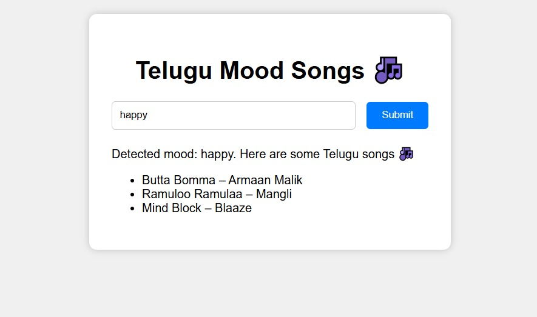
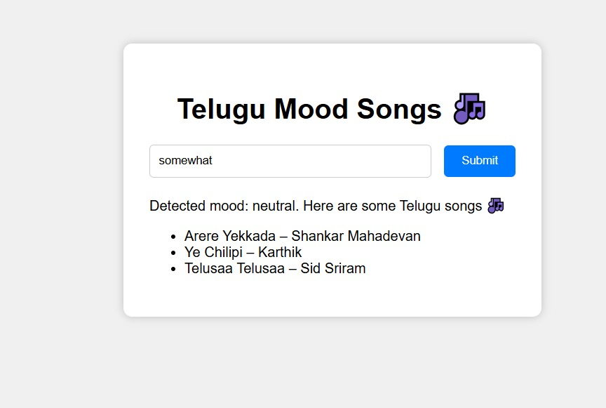
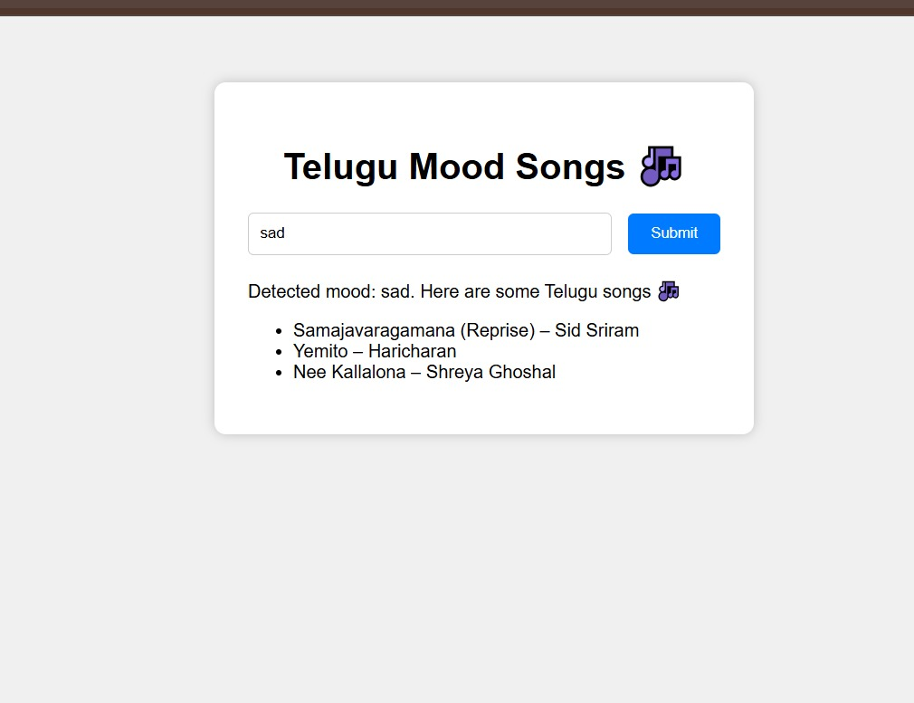

# 🎶 Telugu Mood Songs Bot

A simple **Flask web app** that detects your mood from text input and suggests **Telugu songs** based on your mood.  
No external APIs (like Spotify) are required — it uses a fixed list of Telugu songs.

## Features
- Detects mood ("happy", "sad", "neutral") using simple keyword matching.
- Suggests predefined Telugu songs for each mood.
- Clean and simple web interface (HTML + CSS + JS).
- Lightweight — only requires **Flask**.

 *** Structure

telugu-mood-app/
├── app.py              # Flask backend

├── templates/
│   └── index.html      # Frontend UI

└── static/
    └── style.css       # Styling

##  Installation & Setup

1. **Clone the repository** (or download the zip):
  
   git clone https://github.com/your-username/telugu-mood-app.git
   cd telugu-mood-app
  

2. **Create a virtual environment** (optional but recommended):
   
   python -m venv venv
   venv\Scripts\activate   # On Windows
   
   source venv/bin/activate  # On Mac/Linux
  

4. **Install dependencies**:
   
   pip install flask
  

5. **Run the app**:
   
   python app.py
  

6. Open your browser and go to:
   
  you can see the local ip address click on that
   

## 🎯 Usage
- Type in your mood (e.g., *I am happy today* or *Feeling sad*).
- The app will detect your mood.
- You’ll get a list of Telugu songs matching your mood.

## 📸 Screenshot

## 🛠️ Tech Stack
- **Python 3**
- **Flask** (for backend)
- **HTML, CSS, JavaScript** (for frontend)

## 🤝 Contributing
Feel free to fork this repo, make improvements, and create pull requests. Suggestions are always welcome!

##  License
This project is licensed under the MIT License – feel free to use and modify.
